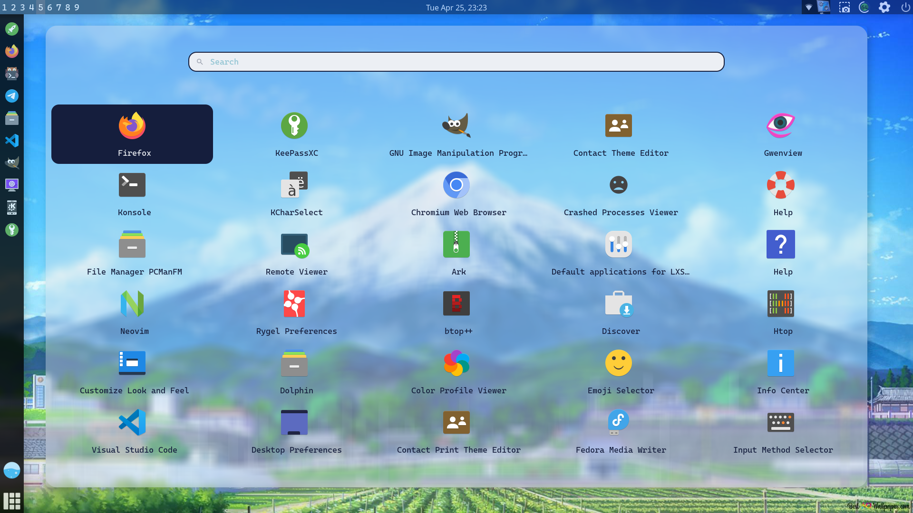
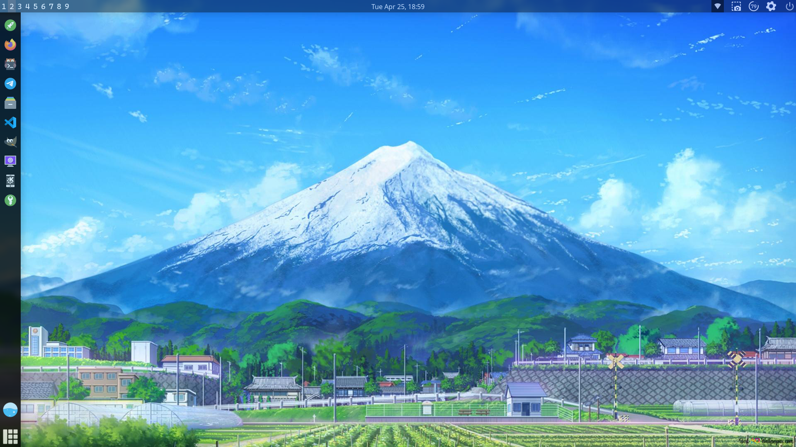
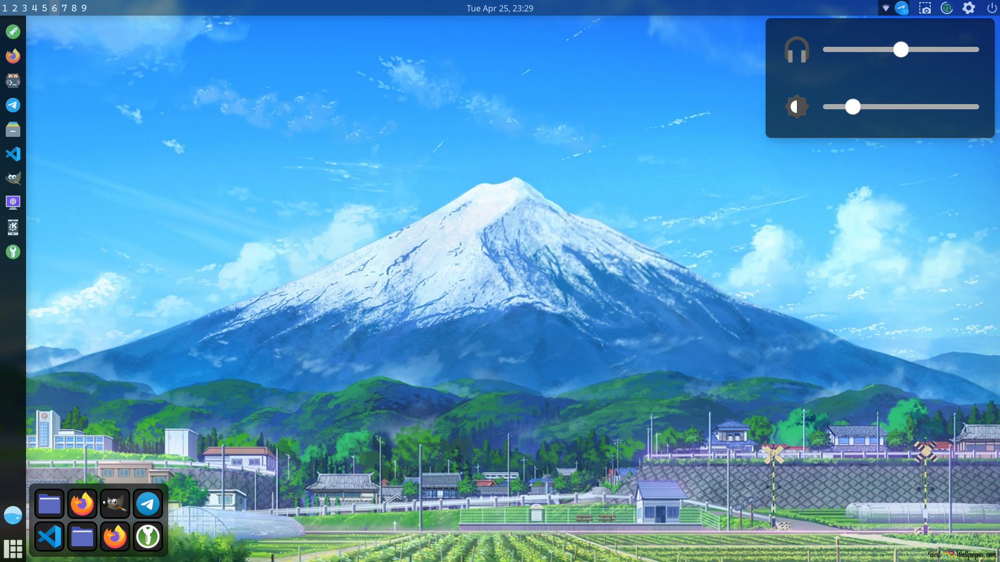
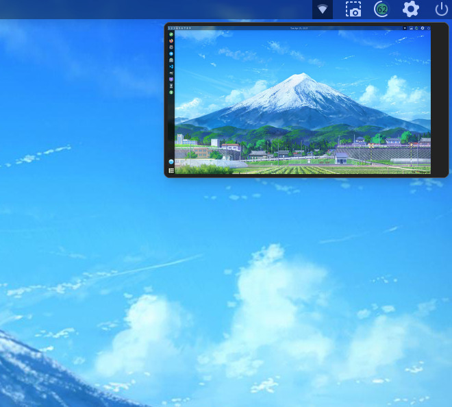
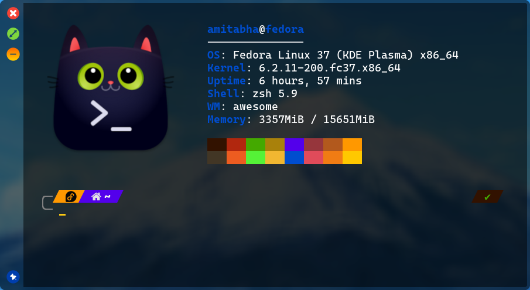

# Awesome Dotfiles
This is my collection of config files used for the <a href="https://www.reddit.com/r/unixporn/comments/12yk2zl/awesome_finally_i_have_learnt_to_customize/?utm_source=share&utm_medium=web3x&utm_name=web3xcss&utm_term=1&utm_content=share_button">awesome wm rice</a>. Some of the details of the rice are :-

- <b>Window Manager: </b> Awesome wm (<i>Obviously! lol</i>)
- <b>Distro</b>: Fedora 37
- <b>terminal: </b> Kitty
- <b>Shell: </b> ZSH
- <b>Editor: </b> Neovim (<i>Astro nvim distro</i>)
- <b>File Manager: </b> Pcmanfm

If you want to mimic the setup, read through the dotfiles, all details are there. Hope you will not have any issues. For any issues feel free to inform me. Also all suggestions are welcome.

<b><i>DIsclaimer: </i></b> All the codes are really messy. Also I am quite new with awesome window manager so do not have much experience. 

<div style="text-align:center"></div>

## Dependencies

- **Awesome Wm:** For this configuration i used the awesome package available on fedora repo and *not the awesome-git version*. Did not tested on the awesome-git, so can't tell about that.
- **Rofi:** A super customizable app-launcher.
- **Picom:** Compositor used for window blur and rounded corners.
- **Dunst:** For the notifications of screenshots. You can probably use naughty for that but I'm too noob for that. Didn't bothered about that.
- **feh:** For setting wallpaper (*Please don't hate me for that* :disappointed:)
- **scrot:** For capturing screenshots.
- **light:** For changing brightness.
- **Amixer:** For volume control.
- **Xinput:** For touchpad gestures to work.
- **Fonts:** CaskaydiaCove Nerd Font, JetBrainsMono Nerd Font, Inter Font.
- **acpi:** For battery widget outputs.
- **Icon Pack:** Papirus. (*Included in the repo with additional necessary icons*)

*The apps visible in the left side bar are imagebox widgets, so you probably have to install thise exact apps to work them properly out if the box. Although you can change them of course so don't worry if you don't wanna install them*

## Setup
First make sure to install all the dependencies. You can use the package manager to install all of them.
#### Fedora/Red Hat based Distros:
```bash
sudo dnf install awesome rofi picom dunst feh scrot light xinput acpi
```
#### Debian Based:
```bash
sudo apt install awesome rofi picom dunst feh scrot light xinput acpi
```
#### Arch Based
```bash
sudo pacman -S awesome rofi picom dunst feh scrot light xinput acpi
```
Next clone the repository and enter into the directory:-
```bash
git clone https://github.com/Amitabha37377/Awesome_Dotfiles.git
cd Awesome_dotfiles
```
Copy the folders in their necessery directories:-
```bash
cp -r awesome ~/.config
cp -r rofi ~/.config
mkdir ~/.icons  #if it does not already exists.
cp -r papirus-icon-theme-20230301 ~/.icons
```

## Previews
### Rofi Theme:


### Others:
 




